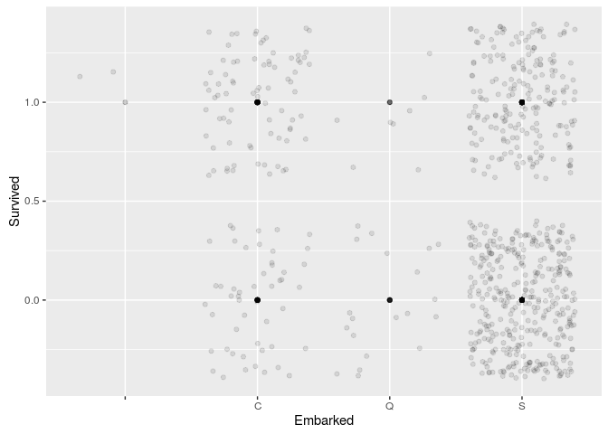
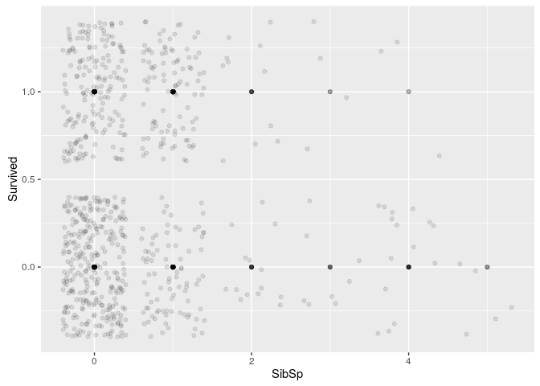

# Titantic Competiton
Observer  
October 17, 2016  


## Included Package

```r
library(caret)
library(doMC)
library(randomForest)
library(data.table)
library(DMwR)
library(stringr)
library(foreach)
#library(doParallel)
```

## Set Core

```r
# using multiple processing... comment this if it does not work
registerDoMC(cores = 7)
```

## Load Data

```r
dtest<-read.csv("./data/test.csv", header = T)
ds<-read.csv("./data/train.csv", header = T)
dtst = dtest
dtst$Survived=0
dtst$src = 1
ds$src = 0
dall<-rbind(ds,dtst)
dall$Survived = as.factor(dall$Survived)
```

## EDA

```r
# Normalized Fare by Pclass
ds$nFare[ds$Pclass==1] = log(ds$Fare[ds$Pclass==1] +0.01) - log(mean(ds$Fare[ds$Pclass==1])+0.01)
ds$nFare[ds$Pclass==2] = log(ds$Fare[ds$Pclass==2] +0.01) - log(mean(ds$Fare[ds$Pclass==2])+0.01)
ds$nFare[ds$Pclass==3] = log(ds$Fare[ds$Pclass==3] +0.01) - log(mean(ds$Fare[ds$Pclass==3])+0.01)
ds$nFare[is.na(ds$nFare)] = 0

ds_m <- ds[!is.na(ds$Age),]
ds_m$Survived <- as.factor(ds_m$Survived)

ggplot(ds_m, aes(SibSp,Age)) + stat_smooth() + geom_point(alpha=0.1)
```

<!-- -->

```r
ggplot(ds_m, aes(factor(Pclass),Age)) + geom_boxplot()
```

<!-- -->

```r
ggplot(ds_m, aes(Parch,Age)) + stat_smooth() + geom_point(alpha=0.1)
```

<!-- -->

```r
ggplot(ds_m[!(ds_m$Embarked==""),], aes(x=Age, fill=Embarked, colour=Embarked)) + geom_density(adjust=1, alpha=0.1)
```

<!-- -->

```r
ggplot(ds_m[ds_m$Pclass==1,], aes(Fare,Age)) + stat_smooth() + geom_point(alpha=0.1)
```

<!-- -->

```r
ggplot(ds_m[ds_m$Pclass==2,], aes(Fare,Age)) + stat_smooth() + geom_point(alpha=0.1)
```

<!-- -->

```r
ggplot(ds_m[ds_m$Pclass==3,], aes(Fare,Age)) + stat_smooth() + geom_point(alpha=0.1)
```

<!-- -->

```r
ggplot(ds_m, aes(Embarked, Survived)) +geom_jitter(alpha=0.1) + geom_point(alpha=0.1)
```

<!-- -->

```r
ggplot(ds_m, aes(SibSp, Survived)) +geom_jitter(alpha=0.1) + geom_point(alpha=0.1)
```

<!-- -->

```r
ggplot(ds_m, aes(Pclass, Survived)) +geom_jitter(alpha=0.1) + geom_point(alpha=0.1)
```

<!-- -->

```r
ggplot(ds_m, aes(Parch, Survived)) +geom_jitter(alpha=0.1) + geom_point(alpha=0.1)
```

<!-- -->

```r
ggplot(ds_m, aes(x=Age, fill=Survived, colour=Survived)) + geom_density(adjust=1, alpha=0.1)
```

<!-- -->

```r
ds_m$AgeDecile = cut(ds_m$Age, c(-2000,7,59,200))

ggplot(ds_m[ds_m$Pclass==1,], aes(x=(nFare), fill=AgeDecile, colour=AgeDecile)) + geom_density(adjust=1, alpha=0.1)
```

<!-- -->

```r
ggplot(ds_m[ds_m$Pclass==2,], aes(x=(nFare), fill=AgeDecile, colour=AgeDecile)) + geom_density(adjust=1, alpha=0.1)
```

<!-- -->

```r
ggplot(ds_m[ds_m$Pclass==3 & as.integer(ds_m$AgeDecile)<3,], aes(x=(nFare), fill=AgeDecile, colour=AgeDecile)) + geom_density(adjust=1, alpha=0.1)
```

<!-- -->

## Supporting Functions

```r
#### function to count number of space in the string
getCountSp <- function(str){
  m<-gregexpr("\\s", str, perl=T)
  return(unlist(length(regmatches(str,m)[[1]])))
}

#### function to generate lookup for cnt per ticket
generate_cnt_by_Ticket<-function(dtf){
  # Create variable for prob to Survive within the same cabin: same cabin usually has same outcome
  dtf<-data.frame(Ticket=dtf$Ticket, Survived=as.integer(dtf$Survived) -1)
  dt<-data.table(dtf)
  lookup<-dt[,list(cnt_ticket = .N), by=Ticket]
  return(lookup)
}

#### function to generate samples from Beta distribution; piror dist. = Beta(0.5,0.5) : no info prior; posterior = Beta(1+Survived, 1+dead)
###### the prior probability is used to control how much information of p_Survived. p_Survived is a average survived per ticket of known cases. 
###### It is already a leakage of data. However, I want to capture the fact that people have the same ticket number tends to have the similar outcome.
###### Therefore, using the piror, I can reduce the influence of this variable. This variable should have similar predictive power as title: Mr
generate_BAY_p_ds<-function(i, dtest){
  p <- rbeta(1, dtest$SurvivedTotal[i] + 2, dtest$nsample[i] - dtest$SurvivedTotal[i] + 4)
  return (p)
}

#### function to generate lookup for cnt per Grpticket and number of survived per GrpTicket
generate_n_Survived_GrpTicket<-function(dtf){
  # Create variable for prob to Survive within the same cabin: same cabin usually has same outcome
  df<-data.frame(GrpTicket=dtf$GrpTicket, Survived=as.integer(dtf$Survived) -1, isMr = dtf$isMr)
  dt<-data.table(df)
  lookup<-dt[,list(SurvivedTotal = mean(Survived) * .N, nsample = .N), by=list(GrpTicket, isMr)]
  return(lookup)
}

#### function to add information in lookup by name into data set
add_info_by_name <- function(dtr, name_, lookup){
  dt <- merge(x=dtr, y=lookup, by=name_, all.x=T)
  return(dt)
}

#### function to extract cabin number
get_CabinNum<-function(ll){
  v <- as.numeric(unlist(strsplit(unlist(strsplit(ll, " "))[length(unlist(strsplit(ll, " ")))], "[A-Z]"))[2])
  return (v)
}

#### function to create variables before the Age prediction
pretreatment <- function(ds){
  ds$Pclass = as.factor(ds$Pclass)
  
  # Get the title as predictor for Age
  c<-str_locate(ds$Name," ([a-z;A-Z]*)\\.")
  ds$title=substr(ds$Name, c[,1]+1, c[,2]-1)
  ds$title[ds$title=="Ms"] = "Miss"
  ds$title[!(ds$title=="Mr" | ds$title=="Miss" | ds$title=="Mrs" | ds$title=="Master")] = "Other"
  ds$title = as.factor(ds$title)
  
  c<-str_locate(ds$Name,"^([a-z;A-Z;']*)[, -]")
  ds$lastname=as.factor(substr(ds$Name, c[,1], c[,2]-1))
  
  # Create dummy variable isSingle... 
  ds$noSibSp = as.factor(ds$SibSp == 0)
  ds$isSingle <- as.factor(ds$Parch==0)
  ds$isSinglenoSibSp <- as.factor(ds$SibSp == 0 & ds$Parch==0 )
  ds$hasCabin = as.factor(ds$Cabin=="")
  ds$CabinLet = substr(ds$Cabin, 1, 1)
  ds$CabinLet[ds$CabinLet=="T"] = ""
  ds$CabinLet = as.factor(ds$CabinLet)
  ds$CabinCnt = as.integer(!ds$Cabin=="") + sapply(ds$Cabin,getCountSp, simplify=T)
  ds$CabinNum = -10
  ll <- as.character(ds$Cabin[!as.character(ds$Cabin)==""])
  ds$CabinNum[!as.character(ds$Cabin)==""] = CabinNum<-sapply(ll, get_CabinNum)
  ds$CabinNum[is.na(ds$CabinNum)] = -10
  ds$familySz = ds$SibSp + ds$Parch
  
  ds$ln_Fare = log(ds$Fare+0.01)
  ds$nFare[ds$Pclass==1] = log(ds$Fare[ds$Pclass==1] +0.01) - log(mean(ds$Fare[ds$Pclass==1])+0.01)
  ds$nFare[ds$Pclass==2] = log(ds$Fare[ds$Pclass==2] +0.01) - log(mean(ds$Fare[ds$Pclass==2])+0.01)
  ds$nFare[ds$Pclass==3] = log(ds$Fare[ds$Pclass==3] +0.01) - log(mean(ds$Fare[ds$Pclass==3])+0.01)
  ds$nFare[is.na(ds$nFare)] = 0
  
  ds$hasNoChildren = (ds$SibSp==1 & ds$Parch==0)
  ds$r_SibSp_Parch = ((ds$SibSp+0.01)/(ds$SibSp+ds$Parch+0.01))
  
  # Similar location would have similar outcome
  # Get total number of people per ticket
  lookup<-generate_cnt_by_Ticket(ds)
  ds<-add_info_by_name(ds,"Ticket",lookup)
  # Define the group ticket that has more than 2 people
  ds$GrpTicket = "XXXXXXX"
  ds$GrpTicket[ds$cnt_ticket>1] = as.character(ds$Ticket[ds$cnt_ticket>1])
  
  # For the ungrouped passenger, group them by cabin
  df<-table(ds$Cabin[as.character(ds$GrpTicket)=='XXXXXXX'])
  lu<-as.data.frame(names(df[df>1]))
  names(lu)<-c("Cabin")
  lu$flag <- 1
  lu<-lu[!lu$Cabin=="",]
  ds<-merge(x=ds, y=lu, by="Cabin", all.x=T)
  ds$GrpTicket[!is.na(ds$flag) & as.character(ds$GrpTicket)=='XXXXXXX']<-as.character(ds$Cabin[!is.na(ds$flag) & as.character(ds$GrpTicket)=='XXXXXXX'])

  # For the rest of ungrouped passenger, group them by last name
  df<-table(ds$lastname[as.character(ds$GrpTicket)=='XXXXXXX'])
  lu<-as.data.frame(names(df[df>1]))
  names(lu)<-c("lastname")
  lu$flag1 <- 1
  lu<-lu[!lu$lastname=="",]
  ds<-merge(x=ds, y=lu, by="lastname", all.x=T)
  ds$GrpTicket[!is.na(ds$flag1) & as.character(ds$GrpTicket)=='XXXXXXX']<-as.character(ds$lastname[!is.na(ds$flag1) & as.character(ds$GrpTicket)=='XXXXXXX'])

  return(ds)
}

#### Try to predict Fare for ticket with single passenger only... Want to use that to deduce fare for individaul in combined ticket... Not sucessful
md_Fare <- function(de) {
  trf_Fare<- lm(I(log(Fare+0.001))~ title + CabinLet * I(as.factor(CabinNum)) + CabinCnt + Embarked , data=de)

  print(summary(trf_Fare))
  return(trf_Fare)
}

#### function to do Age Prediction
  # Predict Age for missings
  # if isSingle and title is Miss, could be older
  # if isSingle and has a lot of SibSp, could be younger
  # if Pclass is controlled, Fare should reflect the age
  # using log(Age) because Age distribution is right-skewed... except the baby... but mostly right skewed
md_Age <- function(ds_m) {
  ds <- rbind(ds_m, ds_m[ds_m$Age > 60,])
  trf_Age<- randomForest(I(log(Age+0.0001))~ title + isSingle*SibSp + I(Parch<=2):I(SibSp>1) + Parch:familySz + SibSp + Pclass + r_SibSp_Parch + CabinLet + CabinNum + CabinCnt+ Embarked + cnt_ticket, data=ds, importance=TRUE,proximity=TRUE,ntree=700)
  print(varImp(trf_Age))
  return(trf_Age)
}

#### function to create variables after the Age prediction
psttreatment <- function(trf_Age, ds) {
  ds_m <- ds
  ds_m$AgePred <- exp(predict(trf_Age, ds_m))
  ds_m$AgeDecile = cut(ds_m$Age, c(-2000,11,15,18,30,49,59,200))
  ds_m$AgePredDecile = cut(ds_m$AgePred, c(-2000,11,15,18,30,49,59,200))
  print(table(ds_m$AgeDecile[!is.na(ds_m$Age)],ds_m$AgePredDecile[!is.na(ds_m$Age)]))
  ggplot(ds_m, aes(AgePred, Age)) + geom_point(alpha=0.1) + geom_smooth(method='lm',formula=y~x)
  # replace NA
  ds_m$noAge <- 0
  ds_m$noAge[is.na(ds_m$Age)]<-1
  ds_m$Age[is.na(ds_m$Age)]<-ds_m$AgePred[is.na(ds_m$Age)]
  # cut by decile
  ds_m$AgeDecile = cut(ds_m$Age, c(-2000,11,15,18,30,49,59,200))
  ds_m$isMr = (ds_m$title == "Mr" & ds_m$Age > 17)
  return(ds_m)
}

#### function to run the prediction
run_prediction <- function(tgbm2, trf, tsvm, dtest){
  ## Run the data through the model
  dtest$pred.tgbm2 = predict(tgbm2, dtest, "raw")
  dtest$pred.rf = predict(trf, dtest, "raw")
  dtest$pred.svm = predict(tsvm, dtest, "raw")
  dtest$pred.vote = as.factor(
                  as.integer(
                      (as.integer(dtest$pred.rf)-1 + as.integer(dtest$pred.svm)-1 + as.integer(dtest$pred.tgbm2)-1)> 1.5
                    )
                  )
  return(dtest)
}
```

## Data Manipulation

```r
dall<-pretreatment(dall)
dall$GrpTicket = as.factor(dall$GrpTicket)
trf_Age <- md_Age(dall[!is.na(dall$Age),])
```

```
##                 Overall
## title         66.794271
## isSingle      13.115486
## SibSp         14.899720
## Pclass        35.015402
## r_SibSp_Parch 18.088859
## CabinLet      16.257478
## CabinNum      20.187664
## CabinCnt       9.727737
## Embarked      15.860519
## cnt_ticket    36.292455
## I(Parch <= 2)  8.267915
## I(SibSp > 1)  10.233819
## Parch         16.407130
## familySz      16.275206
```

```r
ggplot(dall, aes(factor(title),Age)) + geom_boxplot()
```

<!-- -->

```r
ggplot(dall, aes(factor(title),Survived))  + geom_point(alpha=0.1) +geom_jitter(alpha=0.1)
```

<!-- -->

```r
dall<-psttreatment(trf_Age,dall)
```

```
##              
##               (-2e+03,11] (11,15] (15,18] (18,30] (30,49] (49,59] (59,200]
##   (-2e+03,11]          88       0       0       2       0       0        0
##   (11,15]               7       5       3      10       0       0        0
##   (15,18]               4       3       3      59       9       0        0
##   (18,30]               2       4       2     297     111       0        0
##   (30,49]               0       0       1     107     217       2        0
##   (49,59]               0       0       0       9      55       6        0
##   (59,200]              0       0       0       3      21      14        2
```

```r
#trf_Fare <- md_Fare(de <- dall[dall$cnt_ticket==1 & !is.na(dall$Fare),])

ds <- dall[dall$src == 0,]
dtest <- dall[dall$src == 1,]
```

## Modeling

```r
ctrl = trainControl(method="repeatedcv", number=20, repeats=10, selectionFunction = "oneSE")
in_train = createDataPartition(ds$Survived, p=1, list=FALSE)

#dtr <- ds[in_train,]
dtr<-ds

lookup<-generate_n_Survived_GrpTicket(dtr)
dtr<-add_info_by_name(dtr,c('GrpTicket','isMr'), lookup)
dtr$nsample[dtr$GrpTicket == "XXXXXXX"] = dtr$nsample[dtr$GrpTicket == "XXXXXXX"] / 600
dtr$SurvivedTotal[dtr$GrpTicket == "XXXXXXX"] = dtr$SurvivedTotal[dtr$GrpTicket == "XXXXXXX"] / 600
dtr$p_Survived<-sapply(1 : length(dtr$nsample), generate_BAY_p_ds, dtest =dtr)
ggplot(dtr, aes(x=p_Survived, fill=Survived, colour=Survived)) + geom_histogram(alpha=0.5)
```

<!-- -->

```r
# train model using multiple methods
tune_grid <-  expand.grid(interaction.depth = c(1, 3, 9, 11),
                          n.trees = (1:30)*10,
                          shrinkage = 0.1,
                          n.minobsinnode = 10)
tgbm2 = 
  train(
    Survived ~  Sex + p_Survived + cnt_ticket + title + Pclass + CabinLet+CabinNum + CabinCnt + noAge + AgeDecile + SibSp + Parch + Embarked + 
              familySz + nFare + I(nFare/cnt_ticket) + r_SibSp_Parch, data=dtr, method="gbm", 
    tuneGrid=tune_grid, preProc = c("center", "scale"), metric="Kappa", trControl=ctrl, verbose=FALSE
  )

x <- cbind(dtr$Sex, dtr$p_Survived, dtr$cnt_ticket, dtr$title, dtr$Pclass, dtr$CabinLet, dtr$CabinNum, dtr$CabinCnt, dtr$noAge, dtr$AgeDecile, dtr$SibSp, dtr$Parch, dtr$Embarked, dtr$familySz, dtr$nFare, dtr$r_SibSp_Parch)

bestmtry <- tuneRF(x, dtr$Survived, stepFactor=1.5, improve=1e-7, ntree=1000, doBest = F)
```

```
## mtry = 4  OOB error = 15.38% 
## Searching left ...
## mtry = 3 	OOB error = 15.82% 
## -0.02919708 1e-07 
## Searching right ...
## mtry = 6 	OOB error = 15.15% 
## 0.01459854 1e-07 
## mtry = 9 	OOB error = 15.82% 
## -0.04444444 1e-07
```

<!-- -->

```r
print(bestmtry)
```

```
##       mtry  OOBError
## 3.OOB    3 0.1582492
## 4.OOB    4 0.1537598
## 6.OOB    6 0.1515152
## 9.OOB    9 0.1582492
```

```r
tune_grid <- expand.grid(.mtry=c(bestmtry[bestmtry[,2] == min(bestmtry[,2]),1]))

trf = 
  train(
    Survived ~  Sex + p_Survived + cnt_ticket + title + Pclass + CabinLet+ CabinNum + CabinCnt + noAge + AgeDecile + SibSp + Parch + Embarked + 
              familySz + nFare + I(nFare/cnt_ticket) + r_SibSp_Parch, 
    data=dtr, method="rf", metric="Kappa", tuneGrid=tune_grid, trControl=ctrl, preProc = c("center", "scale"), verbose=FALSE, ntree=1000
  )

#method="svmLinear","svmPoly" svmRadial
tsvm = 
  train(
    Survived ~  Sex + p_Survived + cnt_ticket + title + Pclass + CabinLet + CabinNum + CabinCnt + noAge + AgeDecile + SibSp + Parch + Embarked + 
              familySz + nFare + I(nFare/cnt_ticket) + r_SibSp_Parch  , tuneGrid = data.frame(.C = seq(0,0.95,0.05) + 0.05),
    data=dtr, method="svmLinear",
    #tuneLength=10, 
    metric="Kappa", trControl=ctrl, verbose=FALSE, preProc = c("center", "scale")
  )

## Variables importance
varImp(tgbm2)
```

```
## gbm variable importance
## 
##   only 20 most important variables shown (out of 34)
## 
##                     Overall
## titleMr             100.000
## p_Survived           56.069
## Sexmale              51.071
## CabinNum             17.700
## Pclass3              16.142
## CabinCnt             11.017
## cnt_ticket            2.742
## I(nFare/cnt_ticket)   2.294
## titleMrs              1.767
## familySz              1.627
## titleOther            0.000
## CabinLetB             0.000
## CabinLetD             0.000
## CabinLetC             0.000
## SibSp                 0.000
## AgeDecile(18,30]      0.000
## titleMiss             0.000
## CabinLetE             0.000
## EmbarkedQ             0.000
## nFare                 0.000
```

```r
varImp(trf)
```

```
## rf variable importance
## 
##   only 20 most important variables shown (out of 34)
## 
##                     Overall
## p_Survived          100.000
## titleMr              71.489
## Sexmale              66.157
## CabinNum             25.713
## cnt_ticket           25.285
## I(nFare/cnt_ticket)  24.643
## nFare                23.395
## Pclass3              19.093
## titleMrs             18.140
## titleMiss            17.147
## familySz             15.970
## CabinCnt             14.887
## r_SibSp_Parch        10.772
## SibSp                10.494
## AgeDecile(30,49]      8.004
## EmbarkedS             7.383
## AgeDecile(18,30]      7.349
## Parch                 6.831
## noAge                 5.442
## EmbarkedC             5.327
```

## Resampling

```r
resampls = resamples(list(RF = trf,
                          GBM = tgbm2, SVM = tsvm
                         ))
difValues = diff(resampls)
summary(difValues)
```

```
## 
## Call:
## summary.diff.resamples(object = difValues)
## 
## p-value adjustment: bonferroni 
## Upper diagonal: estimates of the difference
## Lower diagonal: p-value for H0: difference = 0
## 
## Accuracy 
##     RF      GBM       SVM      
## RF          -0.002572  0.012063
## GBM 1.00000            0.014635
## SVM 0.04401 0.01332            
## 
## Kappa 
##     RF      GBM      SVM     
## RF          -0.00465  0.02277
## GBM 1.00000           0.02743
## SVM 0.10870 0.04359
```

```r
bwplot(resampls, layout=c(2,1))
```

<!-- -->

## Generate Summit File for Competition

```r
# Regenerate lookup using all training info
lookup<-generate_n_Survived_GrpTicket(ds)

# Create variable for prob to Survive with the same ticket
dtest<-add_info_by_name(dtest,c('GrpTicket','isMr'), lookup)
dtest$SurvivedTotal[is.na(dtest$SurvivedTotal)] = 0
dtest$nsample[is.na(dtest$nsample)] = 0

## Run the data through the model
dtest$nsample[dtest$GrpTicket == "XXXXXXX"] = dtest$nsample[dtest$GrpTicket == "XXXXXXX"] / 600
dtest$SurvivedTotal[dtest$GrpTicket == "XXXXXXX"] = dtest$SurvivedTotal[dtest$GrpTicket == "XXXXXXX"] / 600

n <- 10000
a <-  foreach (i = 1:n, .combine = rbind) %dopar%
{
  dtest$p_Survived<-sapply(1 : length(dtest$nsample), generate_BAY_p_ds, dtest =dtest)
  dtest<-run_prediction(tgbm2, trf, tsvm, dtest)
  as.integer(dtest$pred.tgbm2) - 1 + as.integer(dtest$pred.rf) - 1 + as.integer(dtest$pred.svm) - 1
}
pred.vote = colSums(a)
hist(pred.vote)
```

<!-- -->

```r
dtest$pred.vote = as.integer(pred.vote>=as.integer(n*3/2))

## Format the summit file and save to ./data/pred.csv
dSummit<-as.data.frame(cbind(dtest$PassengerId,as.integer(dtest$pred.vote)))
names(dSummit)=c("PassengerId","Survived")
write.table(dSummit,"./data/pred.csv", row.names=F, col.names = T, sep=",", quote=FALSE)
```
